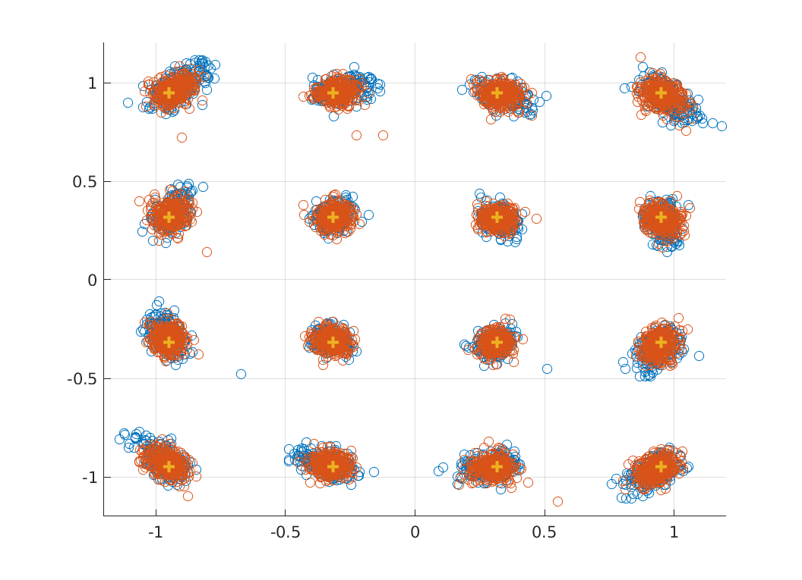

## 5G PHY Implementation

In this code, you can measure the metrics, including CFO/SNR/EVM/BLER/BER/CSI, under the 5G standard between two USRPs.

First things first, you need a pair of USRPs and the installed UHD. You may follow the link below to install UHD:

https://files.ettus.com/manual/page_build_guide.html

### Step 1: Configure UHD Interfaces

Different UHD versions have different executable files. Therefore, you may need to replace the executable files in this code with the example executable files in your UHD version.

Go to the `example` folder of your UHD installations, which is `/usr/local/lib/uhd/examples/` by default, and then

1. Copy the TX executable file `tx_samples_from_file` and replace it under `./tx2rx/tx_samples_from_file` of this repo.
   For example, you can try `cp /usr/local/lib/uhd/examples/tx_samples_from_file ./tx2rx/`.
2. Copy the RX executable file `rx_samples_to_file` and replace it under `./tx2rx/rx_samples_to_file` of this repo.
   For example, you can try `cp /usr/local/lib/uhd/examples/rx_samples_to_file ./tx2rx/`.

### Step 2: Configure USRP Parameters

In MATLAB, open `GetParam.m`, and configure the parameters below:

1. `param.carrier`: the carrier frequency of the TX and RX;
2. `param.deviceTx` and `param.deviceRx`: the IP address for the TX/RX USRP.
3. `param.subdevTx` and `param.subdevRX`: the subdevice settings of the TX/RX USRP, e.g., `A:0` for X series and `A:A` for B series, and you may find more details in the link below:
   https://files.ettus.com/manual/page_configuration.html
4. `param.gainTx` and `param.gainRx`: the TX/RX gain of the USRPs, whose range varies over different USRP types, which can be found by running `uhd_usrp_probe` command in the terminal.

### Step 3: Conduct the Transmission

In MATLAB, open `main.m`, and directly run this script.

The packet transmitted and analyzed contains one time slot of 5G, where the 14 OFDM symbols are organized as:

`PDSCH - PDSCH - DMRS -DMRS -PDSCH - PDSCH - PDSCH - PDSCH - PDSCH - PDSCH - DMRS - DMRS - PDSCH - PDSCH`

including 10 PDSCH symbols carrying data and 4 DMRS symbols for calibration.

The displayed information includes:
1. `CFO`: carrier frequency offset
2. `SNR`: signal-to-noise ratio
3. `EVM`: error vector magnitude
4. `BLER`: block error rate (only one block is transmitted and it can be either `0` for success and `1` for failure);
5. `BER`: bit error rate
6. `Constel.png`: the saved constellation plot; an example of the constellation plot is shown below, the two colors mean the PDSCH in the side/middle of the time slot

**(Optional)** 
Beyond USRP, you may set the IBM 28 GHz PAAM boards in the COSMOS testbed following the link below:

[https://wiki.cosmos-lab.org/wiki/Tutorials/Wireless/mmwavePaamBasics](https://wiki.cosmos-lab.org/wiki/Tutorials/Wireless/mmwavePaamLinkRate)

To conduct this on COSMOS (where MATLAB is not certificated), you may pause the MATLAB code at `line 35 in tx2rx/Tx2Rx.m`, following the three steps before resuming:
1. Upload the generated binary file for the transmitted waveform in `tx2rx/Buffer/Tx.bin` to the COSMOS server,
2. Execute the bash script `Tx2Rx.sh` using exactly the same verbose (except the paths) provided by `line 35 in tx2rx/Tx2Rx.m`,

   e.g., `"bash Tx2Rx.sh 3000000000 50000000 192.168.70.3 A:0 15 ./Buffer/Tx.bin 192.168.70.9 A:0 15 ./Buffer/Rx.bin 3057960"`
4. Download the binary file for the received waveform in `tx2rx/Buffer/Rx.bin` to local.

Note that on the COSMOS server, you should follow the same folder structure within `tx2rx/`, and the two UHD applications (`tx_samples_from_file` and `rx_samples_to_file`) are required.

### Step 4: Change the SNR/MCS

To change SNR, you may either
1. Change the amplitude (by default, `0.5`) of the generated waveform in line 13 of `main.m`, or
2. Change the TX gain in `GetParam.m`

To change MCS, open `GetParam.m` and customize `param.modu` for modulation and `param.code` for code rate.

For the 28 levels of MCSs in 5G, you may refer to the table `Table 5.1.3.1-2: MCS index table 2 for PDSCH` in the link below:

[https://www.sharetechnote.com/html/5G/5G_MCS_TBS_CodeRate.html](https://www.sharetechnote.com/html/5G/5G_MCS_TBS_CodeRate.html)

Note that we always assign the `TX/RX` port for transmission and `RX2` port for reception.
