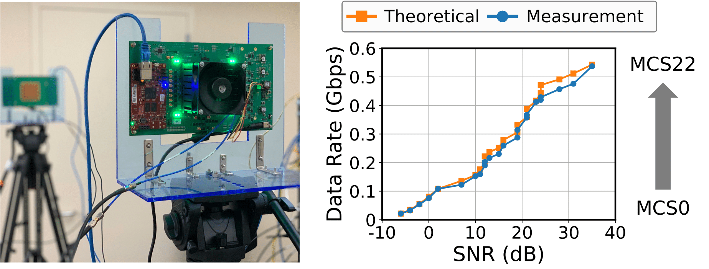

## 5G Protocol Implementation

In this code, you can measure the metrics, including CFO/SNR/EVM/BLER/BER/CSI, under the 5G standard between two USRPs.

First things first, you need a pair of USRPs and the installed UHD. You may follow the link below to install UHD:

https://files.ettus.com/manual/page_build_guide.html

### Step 0 (Optional): 

Beyond USRP, you may setup the IBM 28 GHz PAAM boards in COSMOS testbed following the link below:

[https://wiki.cosmos-lab.org/wiki/Tutorials/Wireless/mmwavePaamBasics](https://wiki.cosmos-lab.org/wiki/Tutorials/Wireless/mmwavePaamLinkRate)

### Step 1: Configure UHD Interfaces

Different UHD versions have different executable files. Therefore, you may need to replace the executable files in this code by the example executable files in your UHD version.

Go to the `example` folder of your UHD installations, which is `/usr/local/lib/uhd/examples/` by default, and then

1. Copy the TX executable file `tx_samples_from_file` and replace it under `./tx2rx/tx_samples_from_file` of this repo.
2. Copy the RX executable file `rx_samples_to_file` and replace it under `./tx2rx/rx_samples_to_file` of this repo.

### Step 2: Configure USRP Parameters

In MATLAB, open `GetParam.m`, and configure the parameters below:

1. `param.carrier`: the carrier frequency of the TX and RX;
2. `param.subdevTx` and `param.subdevRX`: the subdevice settings of the TX/RX USRP, e.g., `A:0` for X series and `A:A` for B series, and you may find more detials in the link below:
   https://files.ettus.com/manual/page_configuration.html
4. `param.gainTx` and `param.gainRx`: the TX/RX gain of the USRPs, whose range varies over different USRP types, which can be find by running `uhd_usrp_probe` command in the terminal.

### Step 3: Conduct the Transmission

In MATLAB, open `main.m`, and directly run this script.

The displayed information include:
1. `CFO`: carrier frequency offset
2. `SNR`: signal-to-noise ratio
3. `EVM`: error vector magnitude
4. `BLER`: block error rate (only one block is transmitted and it can be either `0` for success and `1` for failure);
5. `BER`: bit error rate
6. `CSI`: the amplitudes and the phases of the channel state information over all the subcarriers
7. `Constel.png`: the saved constellation plot.

### Step 4: Change the SNR/MCS

To change SNR, you may either
1. Change the amplitude (by default, `0.5`) of the generated waveform in line 13 of `main.m`, or
2. Change the TX gain in `GetParam.m`

To change MCS, open `GetParam.m` and customize `param.modu` for modulation and `param.code` for code rate.

Note that we always assign the `TX/RX` port for transmission and `RX2` port for reception.

