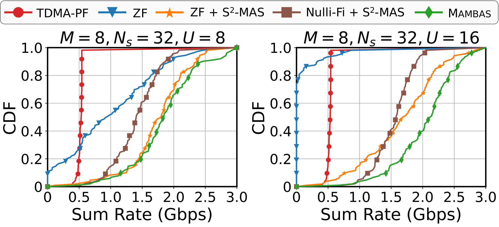
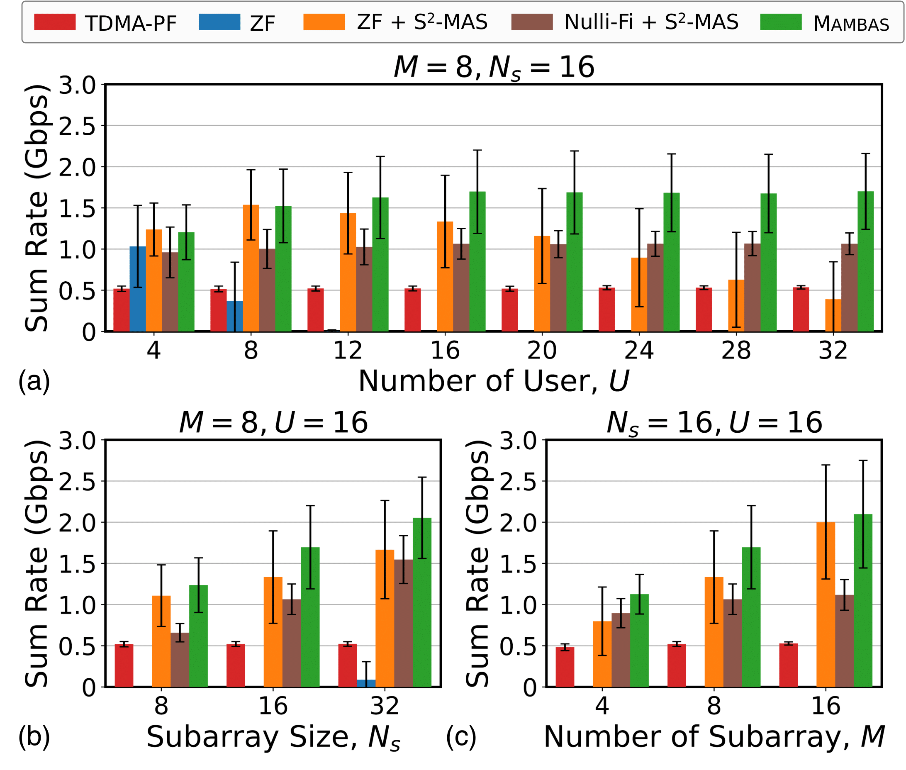

# MobiCom'24 Mambas

In this repostory, you can find two components of codes in `Mambas`:

a) the 5G protocol implementation on the COSMOS testbed (labeled as [Testbed] in paper),

b) the ray-tracing based simulations (labeled as [Simulation] in paper).

## Prerequisite
**Python**
1. `numpy`: e.g., `conda install anaconda::numpy`
2. `tqdm`: e.g., `conda install conda-forge::tqdm`
3. `scipy`: e.g., `conda install anaconda::scipy`
4. `matplotlib`: e.g., `conda install conda-forge::matplotlib`
5. `casadi`: e.g., `conda install conda-forge::casadi`

**MATLAB**
1. `5G Toolbox`

## 5G Protocol Implementation

This 5G protocol implementation measures the over-the-air metrics, SNR, EVM, BLER, BER and etc, under an over-the-air USRP setting. 

You can find the codes in the folder [5g-protocol-implementation](./5g-protocol-implementation), and eventually you can implement the SNR-MCS curves as shown in Fig. 8 in the paper (shown below).

## Ray-Tracing based Simulations

There are three steps in the simulations:
1. Generate the Ray-Tracing dataset in MATLAB
2. Perform Mambas or other baselines on the generated Ray-Tracing dataset
3. Plot the simulation results

You can find the codes in the folder [5g-protocol-implementation](./5g-protocol-implementation), and eventually you can implement the simulation experiments as shown in Fig. 13-14 in the paper (shown below).

