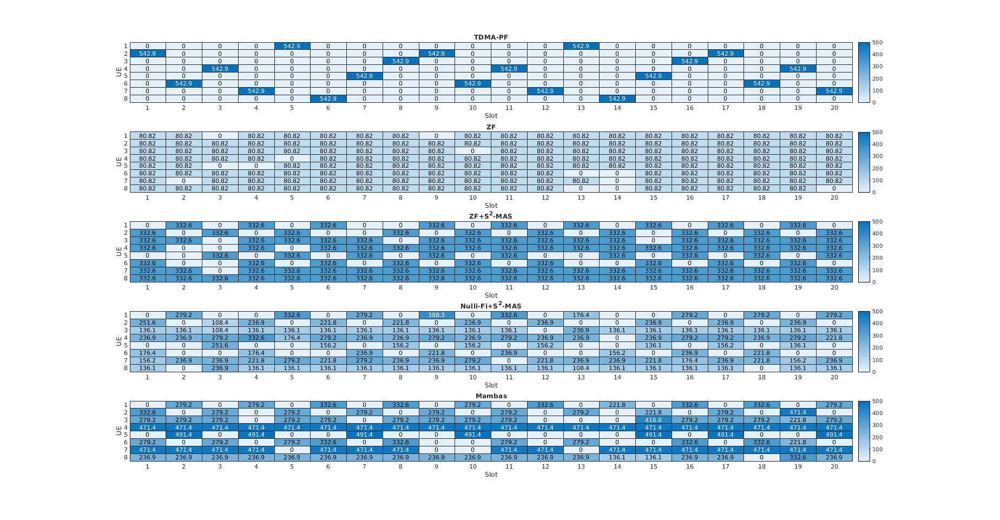

## Ray-Tracing based Simulations

In this code, you can generate your own Ray-Tracing dataset in MATLAB and perform the simulation of Mambas.

### Step 1: Generate the Ray-Tracing Dataset

In MATLAB, open `RayTracing.m`.

You can customize the three parameters below:

1. `ueNum`: the number of users;
2. `distBound`: the min/max BS-user distance in the unit of `m`;
3. `angleBound`: the field of view (FoV) of the BS, or the min/max azimuth angle of the users, in the unit of `degree`.

Below is an example of the MATLAB Ray-Tracing interface.

Generating the whole dataset can take hours. To skip the process, you may unzip `Dataset.zip`, which is pre-generated under the given settings.

### Step 2: Perform Mambas

In Python, open `main.py`.

You can customize the arguments below:

1. `scheduler`: the user selection algorithm, where
   - **`DP`**: the dynamic programming algorithm proposed in the paper;
   - `TDMA`: the baseline that only selects a single user using standard proportional fair (PF);
   - `All`: the baseline that always select all the users;
   - `Spacing`: the baseline of `S2-MAS` that selects the subset of users with a minimum angular spacing;
3. `optimizer`: the beamforming optimization algorithm, where
   - `Individual`: the `MAX-GAIN-ZF` algorithm proposed in the paper;
   - `Conjugate`: the baseline of conjugate beamforming, discussed in Eq. (2) in the paper;
   - `MU-ZF`: the baseline of full digital multi-user beamforming with zero-forcing, discussed in Eq. (3) in the paper;
   - `Nullify`: the baseline of `Nulli-Fi`, which fine-tunes the beamforming weights from conjugate beamforming to minimize the cross-user interference;
5. `bound`: the field of view (FoV) of the BS, or the min/max azimuth angle of the users, in the unit of `degree`;
6. `ueNum`: the number of users, which is `U` in the paper;
7. `elem`: the number of elements in a subarray as a `elemx1` geometry, which is `N_s` in the paper;
8. `array`: the number of subarrays in the whole array of subarray, which is `M` in the paper.

Note that `ueNum` or `U` in `main.py` can be smaller than the `ueNum` in `RayTracing.m`, where only the first `U` users will be considered.

Performaing all the algorithms can take days. To skip the process, you may unzip `Result.zip`, which contains most of the combinations above.

### Step 3: Plot the Results

In MATLAB, open `Plot.m`.

You can customize the parameters below to specify the results to be visualized:

1. `scenarioShow`: the scenario index to see the scheduling details;
2. `slotNum`: the number of time slots of the simulation, which should be lower than `20`.

For the first figure (an example show below), it shows the detailed scheduling of one simulated Ray-Tracing scenario (X axis as the time slot index and Y axis as the user index) over baselines and proposed Mambas, where each grid indicates the data rate (in Mbps) achieved given the time slot and user. Note that `0` means either the user is not activated or packet loss.

For the second figure (an example show below), it shows the statistical results over all the Ray-Tracing scenarios w.r.t. the averaged data rates over users per scenario.

